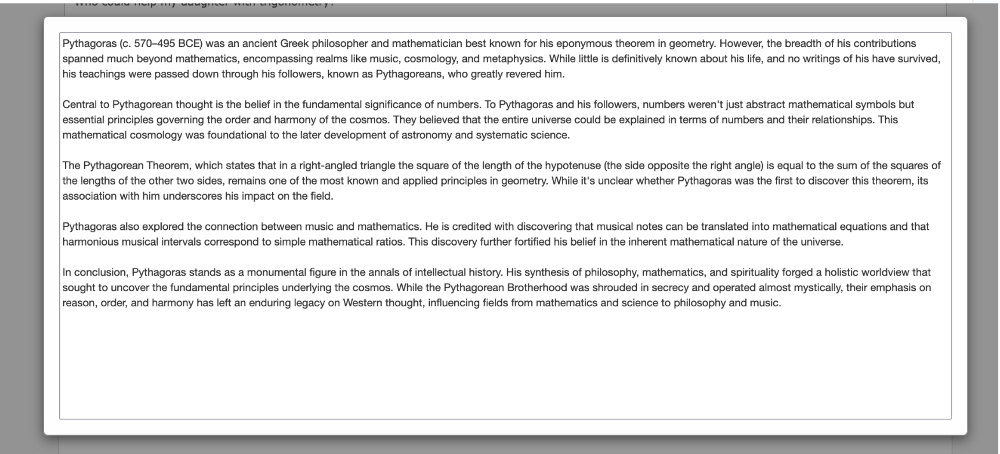
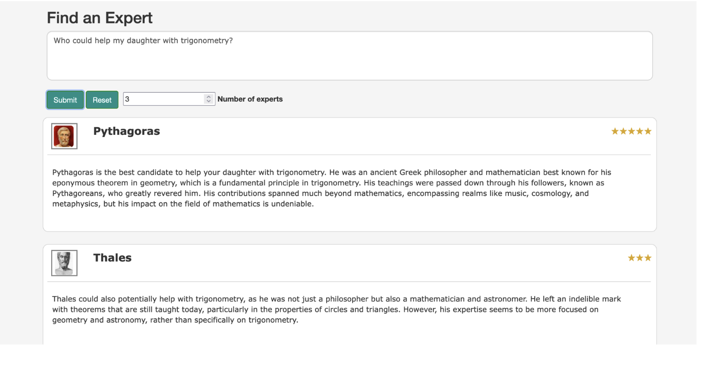

## Expertise Locator Framework - "Philosophers" PoC 

This repo is meant for testing new document and expertise locator concepts in a web app environment. The goal is not to build actual production code, but to still test different patterns, models and API's in a more realistict setup than notebooks.  


## RAG - based locator
The RAG based locator applies two distinct NLP techniques for pinpointing domain-specific expertise, typically within expansive knowledge organizations. The system is structured loosely around the [Retrieval-Augmented Generation (RAG)](https://arxiv.org/pdf/2005.11401.pdf) pattern and is executed in two distinct phases:

1. The initial phase employs cached document embeddings to represent the expertise of individual participants. These embeddings are derived from an array of data sources, such as publications, project narratives, résumés and other pertinent artifacts. Upon receiving a query, the system performs a retrieval action against these embeddings, generating a preliminary list of top-n candidates. This retrieval mechanism ensures the selection of experts whose expertise semantically aligns with the input query. The first phase retrieval does not generate textual metadata about the retrieval results.  

2. The secondary phase brings in a Large Language Model (LLM) for an in-depth evaluation of the initially identified candidates. The LLM generative model appraises the initial embeddings and offers a more refined ranking of experts. Moreover, it furnishes plain text explanations, detailing the rationale behind each expert's placement, thus enhancing the users' and contextual understanding of the results.

One of the primary advantages of this dual-phase approach is its scalability. By concentrating the resource-intensive LLM evaluations to a narrowed set of candidates, the system can handle vast repositories of expert documents more efficiently. This method is more scalable and also less complex compared to a fine-tuning strategy. 

### Example implementation 

In the "Philosophers" toy example, the procedure starts with the preprocessing of documents detailing the knowledge and background of experts, in this case 25 classic philosophers. During this phase, each document is transformed using an embedding model (OpenAI text-embedding-ada-002) to produce vector representations. (These embeddings serve as a distilled version of the philosophers' expertise, enabling efficient comparison and retrieval based on semantic similarity.)

The experts selected as the top-N candidates by a vector distance metric (e.g. cosine) are then introduced to a Large Language Model (LLM) API, such as OpenAI gpt-4. At this juncture, various parameters like tone, temperature, and prompt are configured according to user-defined settings. This step facilitates a more granular evaluation of the candidate documents by the LLM, factoring in the user preferenes and requirements of specific use cases. 

Concluding the procedure, the third phase focuses on result presentation. The LLM outputs the most relevant experts based on the evaluation, supplemented with brief explanations that decode the rationale behind each score. To add a layer of interpretability, the system dispenses metrics related to retrieval confidence. This metric offers a quantitative measure of the confidence level associated with each recommendation. 


#### App init and cache setup
The PoC is hosted as a web app, only a development server implementation - **Not to be used in production** - is provided in this repo. At server startup, a directory with expertise documents is scanned and compared against cached embeddings. If updates are found, the embedding model is called to process the updated documents and cache them. 

```python
# Either get embeddings from the cache, or call  model API to build them. 
def get_embedding_for_doc(string : str,name: str,img_path: str,
    embedding_cache:dict,model: str = EMBEDDING_MODEL) -> list:
    if (name,img_path , model) not in embedding_cache.keys():
        embedding_cache[(name,img_path ,model)] = get_embedding(string ,model) -> OpenAI API
        with open(embedding_cache_path, "wb") as embedding_cache_file:
            pickle.dump(embedding_cache, embedding_cache_file)
    else:
        logger.info('Found '+name+' from cache')
    return embedding_cache[(name,img_path, model)]
```
At the landing page, the user will enter a question (or a describe the topic(s) where help is needed). In the toy-example, a user is looking for a classic philosopher to help with 6th grade math.


#### Expertise retrieval
Whe the user submits a question, the question text is first processed by the embedding model and then compared against the cached document embeddings representing the available experts. 

```python
def find_best_experts(qa_embedding,exp_embeddings,distance_metric="cosine"):
    distances = distances_from_embeddings(qa_embedding, exp_embeddings, distance_metric)
    indices_of_nearest_neighbors = indices_of_nearest_neighbors_from_distances(distances)
    return indices_of_nearest_neighbors,distances
```

In the toy-example, each philosopher was given a 4 paragraph summary of their achievements and areas of exploration. 



After the top-N experts are processed by the second phase LLM model, the sorted results are sent to the browser asynchronously and the results page is updated with the best experts, and explanations for the selections. 

```javascript
 $.ajax({
      type: "POST",
      url: "/query",
      data: JSON.stringify(server_data),
      contentType: "application/json",
      dataType: 'json',
      success: function(result) {
      document.body.style.backgroundImage = "none"; 
      $('#loader').hide(); 
      expertCards.innerHTML = getCardHTML(result);
      }
    });
```

The top-N candidates, generator model's ranking explanations and confidence rating (stars) are shown in the search results. 



## Future plans (Fall 2023)
* Better generalization and code separation.
* Automated model eval workflow, cloud deployment.
* Fine-tuning based retrieval, comparison of model performances.
* Better retrieval quality and explanation metrics for the end user. 


