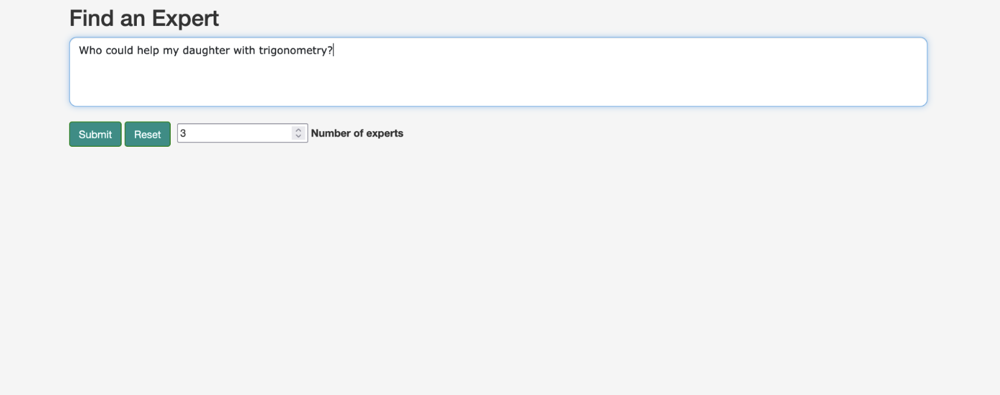

## "Philosophers" PoC Expertise Locator Framework

The Expertise Locator Proof-of-Concept (POC) applies two distinct NLP techniques for pinpointing domain-specific expertise, typically within expansive knowledge organizations. The system is structured (loosely) around the Retrieval-Augmented Generation (RAG) pattern and is executed in two distinct phases:

1. The initial phase employs cached document embeddings to represent the expertise of individual participants. These embeddings are derived from an array of data sources, such as publications, project narratives, résumés and other pertinent artifacts. Upon receiving a query, the system performs a retrieval action against these embeddings, generating a preliminary list of top-n candidates. This retrieval mechanism ensures the selection of experts whose expertise semantically aligns with the input query. The first phase retrieval does not generate textual metadata about the retrieval results.  

2. The secondary phase brings in a Large Language Model (LLM) for an in-depth evaluation of the initially identified candidates. The LLM generative model appraises the initial embeddings and offers a more refined ranking of experts. Moreover, it furnishes plain text explanations, detailing the rationale behind each expert's placement, thus enhancing the users' and contextual understanding of the results.

One of the primary advantages of this dual-phase approach is its scalability. By concentrating the resource-intensive LLM evaluations to a narrowed set of candidates, the system can handle vast repositories of expert documents more efficiently. This method is more scalable and also less complex compared to a fine-tuning strategy. 

### Landing page

TODO: Explain server startup

| Landing page  |  |
| ------------- | ------------- |
At server startup, the expertize document embeddings are pre-calculated, or fetched from cache. The user has the option to select the number of top experts prior to entering a question. | 
The RAG phase 1 explanation..... | 
The RAG phase 2 explanation..... | 
Expertise documentsexplanation..... | 

